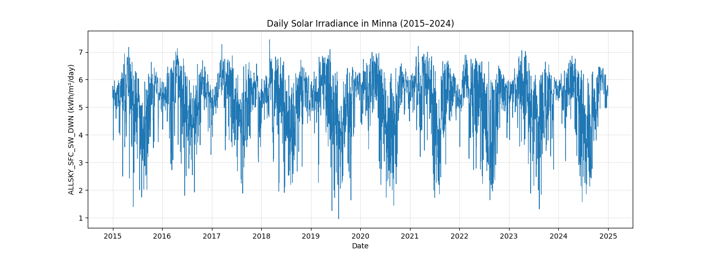

# Solar Irradiance Forecasting — Minna, Niger State, Nigeria

Machine learning model predicting daily solar irradiance in Minna, Nigeria using historical weather data, to support solar energy planning for off-grid and mini-grid operators.

## Problem

Solar power output is highly variable due to weather. Off-grid and mini-grid solar operators in Nigeria need reliable irradiance estimates to plan storage management, diesel backup usage, and system sizing. This model predicts daily surface solar irradiance (ALLSKY_SFC_SW_DWN) from same-day weather conditions for Minna, Niger State.

**Note on scope:** this model predicts irradiance given known same-day weather inputs (e.g. cloud cover, humidity). It is a conditional prediction model, not a future-forecasting system — true forecasting would require predicted (not historical/actual) weather inputs. This scope was a deliberate choice to keep the project hardware-agnostic and focused on the resource-estimation problem.

## Data

- **Source:** [NASA POWER API](https://power.larc.nasa.gov/), daily temporal data
- **Location:** Minna, Niger State, Nigeria (9.6178°N, 6.5569°E)
- **Period:** 2015–2024 (3,653 daily records)
- **Features:** clear-sky irradiance, temperature, relative humidity, cloud amount, wind speed, precipitation
- **Target:** ALLSKY_SFC_SW_DWN (actual surface solar irradiance, kWh/m²/day)

## Method

- Time-based train/test split (train: 2015–2022, test: 2023–2024) to respect temporal order
- Baseline model: Random Forest Regressor
- Comparison model: XGBoost Regressor

## Results

| Model | MAE | RMSE | R² |
|---|---|---|---|
| Random Forest | 0.336 | 0.539 | 0.706 |
| XGBoost | 0.343 | 0.547 | 0.698 |

Random Forest performed marginally better as a baseline. 

**Feature importance (Random Forest):**
1. Cloud Amount — 49.8%
2. Clear-sky irradiance — 15.3%
3. Temperature — 12.4%
4. Relative Humidity — 7.6%
5. Day of year — 6.4%

This aligns with the physical drivers of solar irradiance — cloud cover dominating makes physical sense and validates the model learned real relationships, not noise.

## Future Work

- Add lag features (previous-day cloud cover/irradiance) to capture weather persistence
- Integrate live weather forecast APIs for true short-term forecasting
- Extend to panel-output estimation as an optional downstream layer

## Tech Stack

Python, pandas, scikit-learn, XGBoost, matplotlib, NASA POWER API
